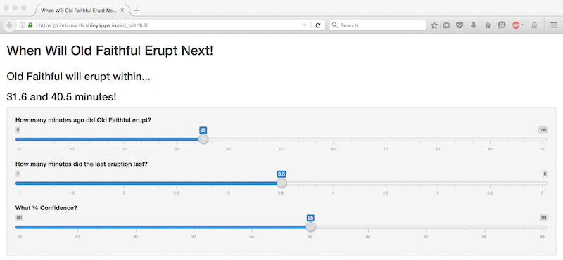

## Imagine the following situation...

You are visiting Yellowstone National Park and are standing in front of the legendary Old Faithful. It's late in the day and you are interested in making a dinner reservation at the Old Faithful Inn. The restaurant only has table openings 30 minutes and 90 minutes from now. You don't want to miss this golden opportunity to snap a photo in front of an erupting Old Faithful but you (and your kids) are very hungry. Will Old Faithful erupt within the next 30 minutes, allowing to satisfy your hunger as soon as possible while also snapping a priceless family vaction photo, or should you wait for the reservation 90 minutes from now to guarantee you get your photo?

--- .class #id 

## Lucky for you... You have access to R !

Using the built-in data set "faithful" we can predict when Old Faithful will erupt next given when it last erupted and how long the eruption lasted.

```{r}
data(faithful)
colnames(faithful)
```
The column "eruptions" represents the number of minutes a given eruption lasted. The column "waiting" represents the number of minutes the next eruption occured. With this data we will build a predictive model to solve our dilema.

--- .class #id 

## Building the Predictive Model
Given the Old Faithful eruption data we can build the following simple linear model to predict when the next eruption will occur within a certain confidence interval.

```{r, results='hide'}
model <- lm(faithful$waiting ~ faithful$eruptions)
sumCoeff <- summary(model)$coefficients
slope <- sumCoeff[2,1] + c(-1,1)*qt(0.975,df=model$df) * sumCoeff[2,2]
intercept <- sumCoeff[1,1] + c(-1,1)*qt(0.975,df=model$df) * sumCoeff[1,2]
```

With this model we can now predict a range for when the next eruption will occur

```{r}
lastEruptDuration <- 3
lastEruptMinutesAgo <- 30
nextEruption <- intercept + slope*lastEruptDuration - lastEruptMinutesAgo
nextEruption
```

--- .class #id 

## Wrapping it in a Shiny App

Since we don't want to type all of the computations every time we need our answer, we can wrap the above in an R shiny application 

<div style='text-align: center;'>
  
</div>

All we now need to do is adjust the sliders for time of last eruption, eruption duration, and confidence level as appropriate to determine when the next eruption will occur. You can use the app yourself here: https://chrismarth.shinyapps.io/old_faithful/
